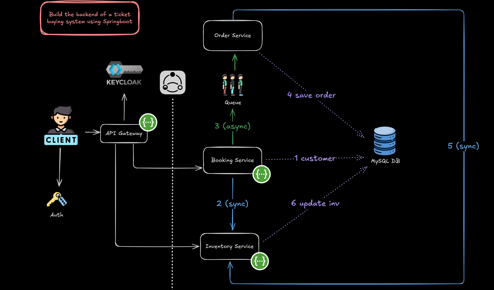
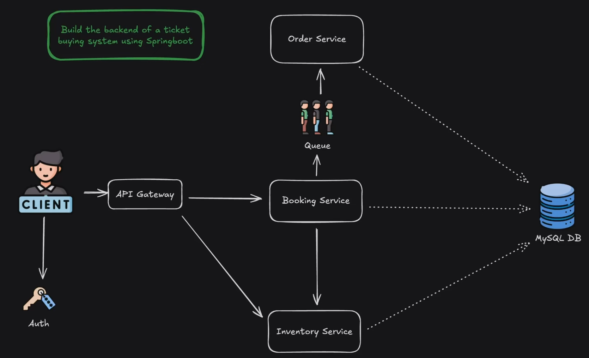
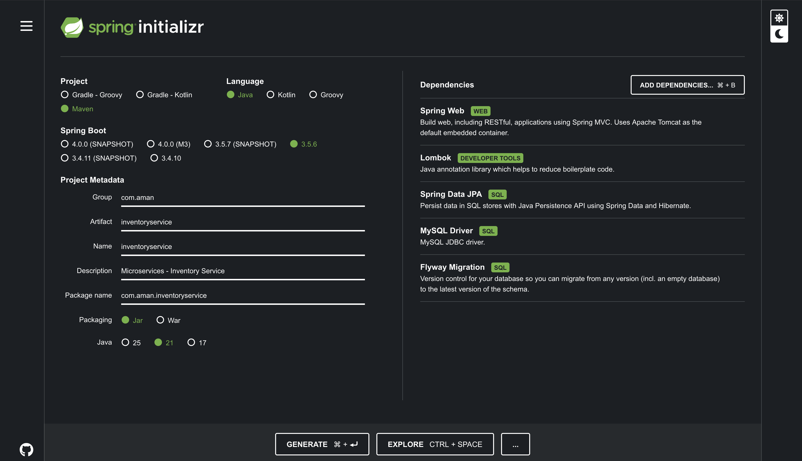
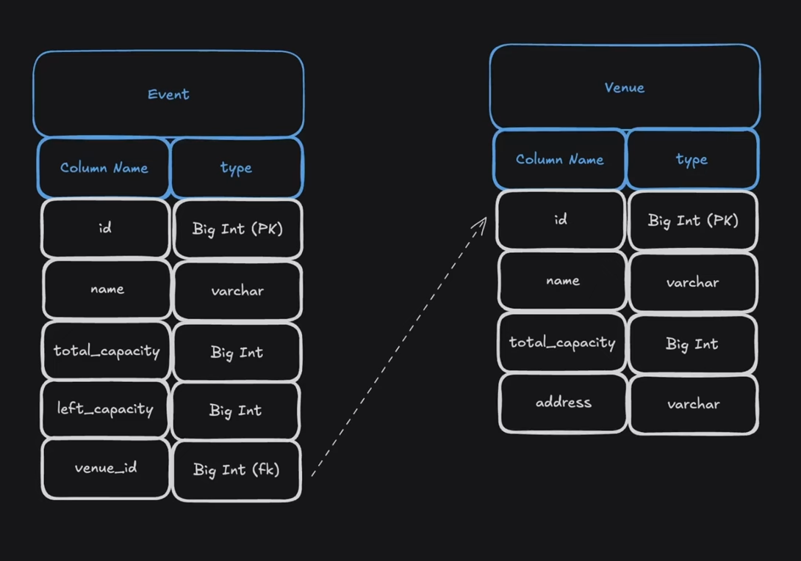
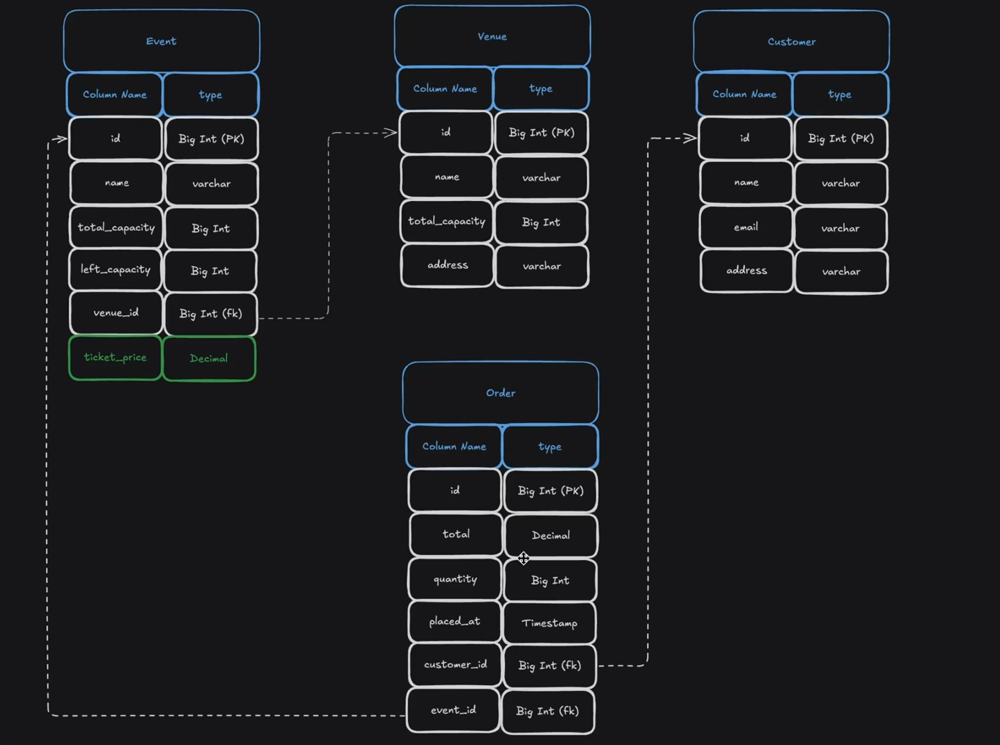
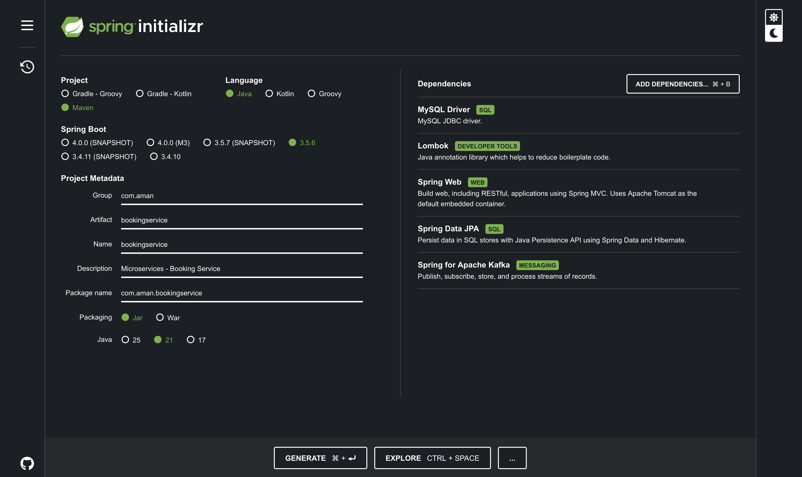

# Ticket Booking System (Spring Boot Microservices)

This project is my hands on attempt to learn and explore the key concepts of microservices architecture using Spring Boot for the backend. It's not a full application but focuses on understanding how it all works.

## High Level Diagram 



This project will help me get hands on with important microservices ideas like Spring Security, API Gateway, and Circuit Breaker. I’ll also apply key technologies such as Spring Boot 3, Kafka, Docker, and others listed in the table to better understand how everything fits together.

| Concepts           |  Technologies                        |
|------------------- |------------------------------------- |
| 1. Spring Security |  1. Spring Boot 3                    |
| 2. API Gateway     |  2. Java 21                          |
| 3. DB Migration    |  3. Docker                           |
| 4. REST API        |  4. Kafka                            |
| 5. API DOCS        |  5. MySQL                            |
| 6. Circuit Breaker |  6. JPA                              |
| 7. Kafka Topics    |  7. Flyway                           |
| 8. Consumers       |  8. Swagger                          |
| 9. Producers       |  9. Lombok                           |
|                    |  10. Postman                         |
|                    |  11. Keycloak                        |
|                    |  12. Resilience 4j                   |
|                    |  13. Functional Endpoint Programming |


## List of Prerequisites for Development

1. IntelliJ Idea

2. Java 21

3. Postman

4. Docker Desktop

5. MySql Workbench

---

## Working Overview :



###  Client

* The end-user interacts with the system through the **Client UI**.
* Authentication is handled before any service access.

### API Gateway

* Acts as a single entry point for all client requests.
* Forwards requests to respective services (e.g., Booking, Inventory).
* Handles **authentication** and **routing**.

### Booking Service

* Core service that handles **ticket booking** logic.
* Checks ticket availability by calling the **Inventory Service**.
* Places booking requests onto a **queue** for asynchronous processing.
* Communicates with **MySQL DB** for storing booking-related data.

### Inventory Service

* Manages the **available ticket inventory**.
* Updates inventory after a successful booking.
* Communicates with the **Booking Service** and **MySQL DB**.

### Order Service

* Listens to the **queue** for incoming booking requests.
* Processes and confirms **ticket orders**.
* Persists order data in the **MySQL Database**.

### Database (MySQL)

* Central data store shared among services (decoupled via repositories).
* Stores data for **Bookings**, **Inventory**, and **Orders**.

### Queue

* Decouples the **Booking** and **Order** services.
* Ensures non-blocking, scalable order processing.

### Service Communication Flow

1. **Client** authenticates → sends booking request via **API Gateway**.
2. **Booking Service** receives the request → checks availability via **Inventory Service**.
3. If tickets are available → Booking is queued.
4. **Order Service** processes the queue → creates an order.
5. All updates are persisted in **MySQL**.

---

## Let's Start Creating Microservices

Let's head to spring initializer and start creating our microservices : [Spring Boot Starter](https://start.spring.io/)

### 1. Inventory Microservices

Let's generate a project and open in IntelliJ for `Inventory Microservice`



Database Schema for Inventory Service



now, as we have created the initial database using docker, now let's create database-tables, using `flyway` it's used in industry. This tool helps to migrate database without using DDL.

[Flyway Official Site](https://www.red-gate.com/products/flyway/community/#maven)

### 2. Booking Microservices

New extended Database Schema



Let's generate a project and open in IntelliJ for `Booking Microservice`



### Added Kafka to Docker Compose

```yml

  zookeeper:
    image: confluentinc/cp-zookeeper:7.5.0
    hostname: zookeeper
    container_name: zookeeper
    ports:
      - "2181:2181"
    environment:
      ZOOKEEPER_CLIENT_PORT: 2181
      ZOOKEEPER_TICK_TIME: 3000

  kafka-broker:
    image: confluentinc/cp-kafka:7.5.0
    container_name: kafka-broker
    ports:
      - "9092:9092"
      - "29092:29092"
    depends_on:
      - zookeeper
    environment:
      KAFKA_BROKER_ID: 1
      KAFKA_ZOOKEEPER_CONNECT: 'zookeeper:2181'
      KAFKA_LISTENER_SECURITY_PROTOCOL_MAP: PLAINTEXT:PLAINTEXT, PLAINTEXT_HOST:PLAINTEXT
      KAFKA_ADVERTISED_LISTENERS: PLAINTEXT://kafka-broker:29092, PLAINTEXT_HOST://localhost:9092
      KAFKA_OFFSETS_TOPIC_REPLICATION_FACTOR: 1

  kafka-ui:
    container_name: kafka-ui
    image: provectuslabs/kafka-ui:latest
    ports:
      - "8084:8080"
    depends_on:
      - kafka-broker
    environment:
      KAFKA_CLUSTERS_NAME: local
      KAFKA_CLUSTERS_BOOTSTRAPSERVERS: kafka-broker:29092
      DYNAMIC_CONFIG_ENABLED: 'true'

  kafka-schema-registry:
    image: confluentinc/cp-schema-registry:7.5.0
    hostname: kafka-schema-registry
    container_name: kafka-schema-registry
    depends_on:
      - kafka-broker
    ports:
      - "8083:8081"
    environment:
      SCHEMA_REGISTRY_HOST_NAME: kafka-schema-registry
      SCHEMA_REGISTRY_KAFKASTORE_BOOTSTRAP_SERVERS: 'kafka-broker:29092'
      SCHEMA_REGISTRY_LISTENERS: http://kafka-schema-registry:8081

```